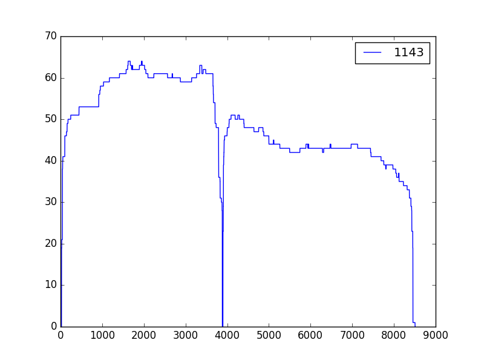

# Rala

[](https://travis-ci.org/rvaser/rala)

Layout module for raw de novo DNA assembly of long uncorrected reads.

## Description
Rala is intended as a standalone layout module to assemble raw reads generated by third generation sequencing. It was inspired by ideas used in [HINGE](https://github.com/HingeAssembler/HINGE) for preprocessing and in [Miniasm](https://github.com/lh3/miniasm) for assembly graph simplification. With the help of coverage graphs, chimeric reads are detected and cut while overlaps between unbridged repeat reads are removed from the dataset (see figures bellow). After preprocessing is done, an assembly graph is built and simplified with transitive reduction, trimming, bubble popping and, as a last resort, heuristics which untangle leftover junctions in graph.

Rala takes as input two files: sequences in FASTA/FASTQ format and overlaps between them in PAF/MHAP format (**without dual overlaps**). Both input files can be compressed with gzip. Output is a set of contigs in FASTA format.

*Coverage graph of a chimeric read*


*Coverage graphs of repetitive reads which overlap is removed*


## Dependencies
1. gcc 4.8+ or clang 3.4+
2. cmake 3.2+

## Installation
To install Rala run to following commands:

```bash
git clone --recursive https://github.com/rvaser/rala.git rala
cd rala
mkdir build
cd build
cmake -DCMAKE_BUILD_TYPE=Release ..
make
```

After successful installation, an executable named `rala` will appear in `build/bin`.

Optionally, you can run `sudo make install` to install rala executable to your machine.

***Note***: if you omitted `--recursive` from `git clone`, run `git submodule update --init --recursive` before proceeding with compilation.

## Usage

Usage of rala is as following:

    rala [options ...] <sequences> <overlaps>

        <sequences>
            input file in FASTA/FASTQ format (can be compressed with gzip)
            containing sequences
        <overlaps>
            input file in MHAP/PAF format (can be compressed with gzip)
            containing pairwise overlaps

        options:
            -t, --threads <int>
                default: 1
                number of threads
            --version
                prints the version number
            -h, --help
                prints out the help

## Contact information

For additional information, help and bug reports please send an email to: robert.vaser@fer.hr.

## Acknowledgement

This work has been supported in part by Croatian Science Foundation under the project UIP-11-2013-7353.
